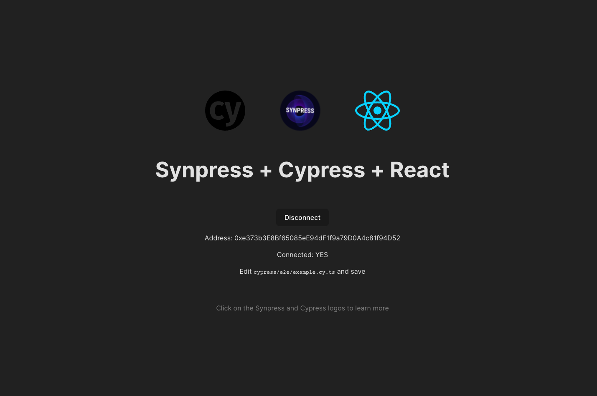

# 🔥 Synpress — dApp E2E Testing

[Synpress](https://github.com/Synthetixio/synpress) is a **"true"** E2E testing framework specific for dApps.&#x20;

## _Sponsored By_&#x20;

<figure><figcaption>
Optimism
</figcaption></figure>

 

<figure><figcaption>
Synthetix
</figcaption></figure>

## _Power users_

<figure><figcaption>
Panther Protocol
</figcaption></figure>

 

<figure><figcaption>
Phantom
</figcaption></figure>

 

<figure><figcaption>
Ethereum Name Service (ENS)
</figcaption></figure>

<figure><figcaption>
Guild
</figcaption></figure>

 

<figure><figcaption>
Aragon
</figcaption></figure>

 

<figure><figcaption>
Delvtech
</figcaption></figure>

<figure><figcaption>
Offchain Labs
</figcaption></figure>

 

<figure><figcaption>
Snapshot Labs
</figcaption></figure>

 

<figure><figcaption>
Hedera
</figcaption></figure>

