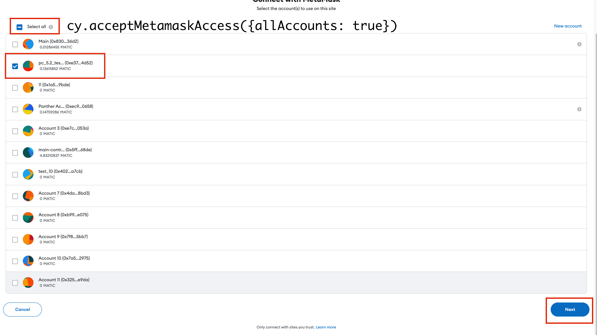
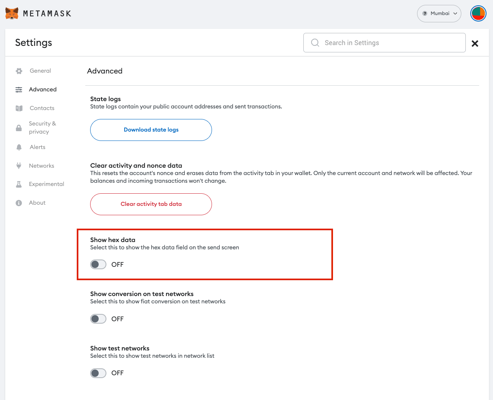
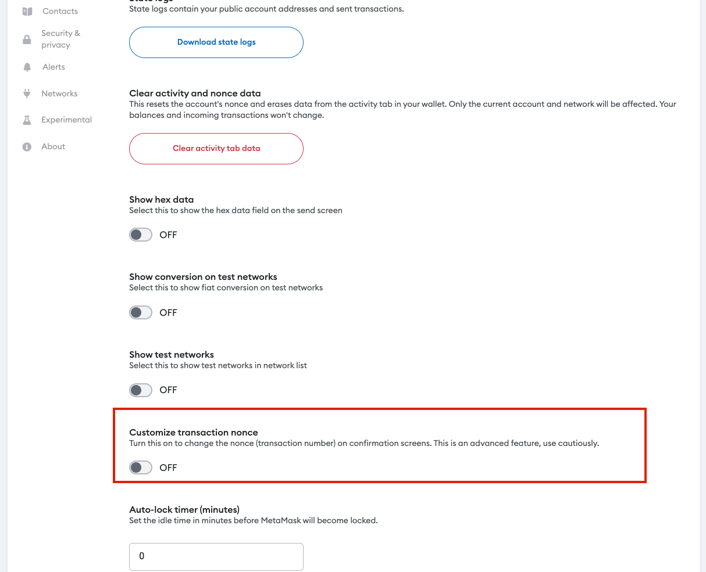
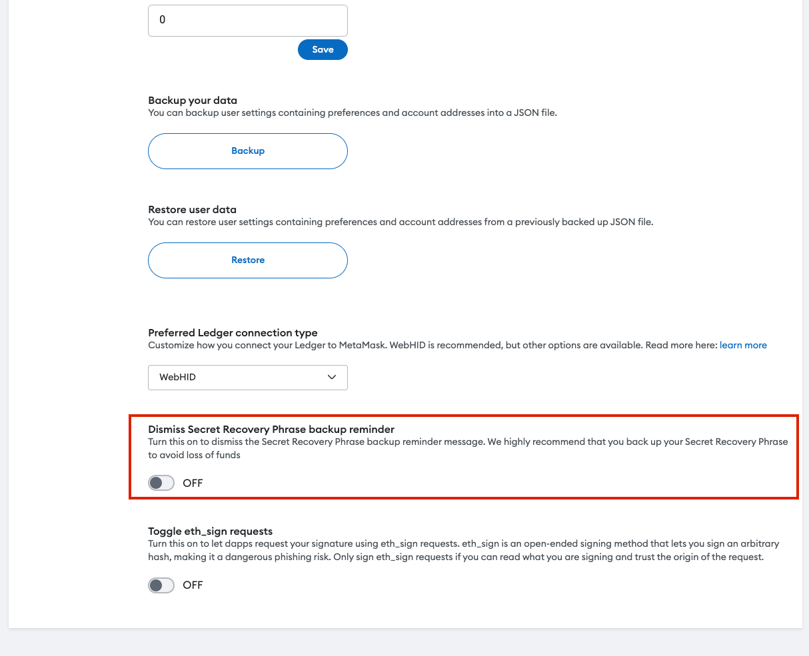

# 🗝 Synpress API

## Initialize Playwright

### Cypress — `cy.initPlaywright()`

Connect Playwright with Cypress instance.

```typescript
function initPlaywright(): Chainable<boolean>;
```

#### Example

```javascript
cy.initPlaywright();
```

### Playwright — `init`

Initialize Playwright instance.&#x20;

```typescript
function init(playwrightInstance: BrowserType<{}>): Promise<boolean>;
```

#### Example&#x20;

```typescript
import * as playwright from "@synthetixio/synpress/commands/playwright";

const connected = await playwright.init();
```

## **`assignWindows`**

Assign currently open tabs with Playwright.

```typescript
function assignWindows(): Chainable<boolean>;
```

### **Cypress**&#x20;

```typescript
cy.assignWindows().should("be.true");
```

### **Playwright**&#x20;

```typescript
import * as playwright from "@synthetixio/synpress/commands/playwright";

const connected = await playwright.init();
const assigned = await playwright.assignWindows();
```

## **`assignActiveTabName`**

Assigns currently active tab.

```typescript
function assignActiveTabName(tabName: string): Chainable<boolean>;
```

### Cypress

```javascript
cy.assignActiveTabName("my_tab");
```

### Playwright&#x20;

```typescript
import * as playwright from "@synthetixio/synpress/commands/playwright";

await playwright.assignActiveTabName("my_tab");
```

## **`isMetamaskWindowActive`**

Checks if the currently active window is Metamask.

<pre class="language-typescript"><code class="lang-typescript"><strong>function isMetamaskWindowActive(): Chainable&#x3C;boolean>;
</strong></code></pre>

### Cypress

```javascript
cy.isMetamaskWindowActive().should("be.true");
```

### Playwright

<pre class="language-typescript"><code class="lang-typescript">import * as playwright from "@synthetixio/synpress/commands/playwright";

<strong>const isActive = await playwright.isMetamaskWindowActive();
</strong></code></pre>

## **`isCypressWindowActive`**

Checks if the currently active window is Cypress.

```typescript
function isCypressWindowActive(): Chainable<boolean>;
```

### Cypress

```javascript
cy.isCypressWindowActive();
```

### Playwright

```typescript
import * as playwright from "@synthetixio/synpress/commands/playwright";

const isActive = await playwright.isCypressWindowActive();
```

## **`switchToCypressWindow`**

Will focus on the Cypress window (tab) (the dApp)

```typescript
function switchToCypressWindow(): Promise<boolean>;
```

### **Cypress**

```javascript
cy.switchToCypressWindow().should("be.true");
```

### Playwright&#x20;

```typescript
import * as playwright from "@synthetixio/synpress/commands/playwright";

const switched = await playwright.switchToCypressWindow();
```

## **`switchToMetamaskWindow`**

Will focus on the Metamask window (tab)&#x20;

```typescript
function switchToMetamaskWindow(): Promise<boolean>;
```

### Cypress

```typescript
cy.switchToMetamaskWindow().should("be.true");
```

### Playwright&#x20;

```typescript
import * as playwright from "@synthetixio/synpress/commands/playwright";

const switched = await playwright.switchToMetamaskWindow();
```

## **`switchToMetamaskNotification`**

Will focus on the Metamask popup and will bring it to the top.&#x20;

```typescript
function switchToMetamaskNotification(): Promise<boolean>;
```

### Cypress

```javascript
cy.switchToMetamaskNotification().should("be.true");
```

### Playwright

```typescript
import * as playwright from "@synthetixio/synpress/commands/playwright";

const switched = await playwright.switchToMetamaskNotification();
```

## `getCurrentNetwork`

Get current network info from Metamask

```typescript
function getCurrentNetwork(): {
  networkName: string;
  networkDisplayName: string;
  networkId: number;
  isTestnet: boolean;
};
```

### Cypress

```typescript
cy.getCurrentNetwork().then((network) => {
  expect(network.networkName).to.be.equal("sepolia");
  expect(network.networkId).to.be.equal(11155111);
  expect(network.isTestnet).to.be.true;
});
```

### Playwright&#x20;

```typescript
import { getCurrentNetwork } from "@synthetixio/synpress/helpers";

const network = getCurrentNetwork();
expect(network.networkName).to.be.equal("sepolia");
expect(network.networkId).to.be.equal(11155111);
expect(network.isTestnet).to.be.true;
```

## **Add Metamask Network**

Add network in MetaMask (and switch to the newly added network).

### Cypress — `addMetamaskNetwork`

```typescript
function addMetamaskNetwork(network: {
  networkName: string;
  rpcUrl: string;
  chainId: string;
  symbol?: string;
  blockExplorer?: string;
  isTestnet: boolean;
}): Chainable<boolean>;
```

#### Example

```typescript
cy.addMetamaskNetwork({
  networkName: "Optimism Network",
  rpcUrl: "https://mainnet.optimism.io",
  chainId: "10",
  symbol: "OETH",
  blockExplorer: "https://optimistic.etherscan.io",
  isTestnet: false,
});
```

### Playwright — `addNetwork`

```typescript
function addNetwork(network: {
  networkName: string;
  rpcUrl: string;
  chainId: string;
  symbol?: string;
  blockExplorer?: string;
  isTestnet: boolean;
}): Promise<boolean>;
```

#### Example&#x20;

```typescript
import * as metamask from "@synthetixio/synpress/commands/metamask";

await metamask.addNetwork({
  networkName: "Optimism Network",
  rpcUrl: "https://mainnet.optimism.io",
  chainId: "10",
  symbol: "OETH",
  blockExplorer: "https://optimistic.etherscan.io",
  isTestnet: false,
});
```

#### **Preview**

<figure><figcaption><p>Add network screen in MetaMask</p></figcaption></figure>

## **Change Metamask Network**

Change network in MetaMask.

Predefined networks: `mainnet`, `goerli`, `sepolia` , `localhost`

If no network is provided, it will default to using the `NETWORK_NAME` environment variable. If not, it will default to `goerli` the network.

### Cypress — `changeMetamaskNetwork`

<pre class="language-typescript"><code class="lang-typescript"><strong>function changeMetamaskNetwork(networkName?: string): Chainable&#x3C;boolean>;
</strong></code></pre>

#### Example

```javascript
// Pass one of the predefined networks (mainnet, goerli, sepolia , localhost)
cy.changeMetamaskNetwork("mainnet");
// Pass the network name (from the Metamask networks dropdown menu)
cy.changeMetamaskNetwork("optimism network");
cy.changeMetamaskNetwork("sepolia");
```

### Playwright — `changeNetwork`

```typescript
function changeNetwork(networkName?: string): Promise<boolean>;
```

#### Example

```typescript
import * as metamask from "@synthetixio/synpress/commands/metamask";

await metamask.changeNetwork("mainnet");
// Switch to the network defined in `process.env.NETWORK_NAME` or default to `goerli`
await metamask.changeNetwork();
```

#### Preview

<figure><figcaption><p>Switch network from Metamask</p></figcaption></figure>

## **Import Metamask Account**

Import a new account in Metamask using a private key.

### Cypress — `importMetamaskAccount`

```typescript
function importMetamaskAccount(pk: string): Chainable<boolean>;
```

#### Example

```javascript
cy.importMetamaskAccount(
  "0x2a871d0798f97d79848a013d4936a73bf4cc922c825d33c1cf7073dff6d409c6"
);
cy.importMetamaskAccount(Cypress.env("E2E_PRIVATE_KEY"));
```

### Playwright — `importAccount`

```typescript
function importAccount(pk: string): Promise<boolean>;
```

#### Example&#x20;

```typescript
import * as metamask from "@synthetixio/synpress/commands/metamask";

await metamask.importAccount(
  "0x2a871d0798f97d79848a013d4936a73bf4cc922c825d33c1cf7073dff6d409c6"
);
await metamask.importAccount(process.env.E2E_PRIVATE_KEY);
```

#### Preview

<figure><figcaption><p>Import account using private key in Metamask</p></figcaption></figure>

## **Create Metamask Account**

### **Cypress** — `createMetamaskAccount`

```typescript
function createMetamaskAccount(accountName?: string): Chainable<boolean>;
```

#### Example

```typescript
// Create a new account with the default name
cy.createMetamaskAccount();
cy.createMetamaskAccount("custom-wallet");
```

### Playwright — `createAccount`

```typescript
function createAccount(accountName?: string): Promise<boolean>;
```

#### Example&#x20;

```typescript
import * as metamask from "@synthetixio/synpress/commands/metamask";

await metamask.createAccount("my_account");
await metamask.createAccount();
```

#### Preview

<figure><figcaption><p>Create new account in Metamask</p></figcaption></figure>

## **Switch Metamask Account**

### **Cypress** — `switchMetamaskAccount`

```typescript
function switchMetamaskAccount(
  accountNameOrAccountNumber: string | number
): Chainable<boolean>;
```

#### Example

```typescript
// Switch using the account number
cy.switchMetamaskAccount(2);
// Switch using the account name
cy.switchMetamaskAccount("account 1");
```

### Playwright — `switchAccount`

```typescript
function switchAccount(
  accountNameOrAccountNumber: string | number
): Promise<boolean>;
```

#### Example&#x20;

```typescript
import * as metamask from "@synthetixio/synpress/commands/metamask";

await metamask.switchAccount("my_account");
await metamask.switchAccount(2);
```

#### Preview

<figure><figcaption><p>Switch account from Metamask</p></figcaption></figure>

## **Get Metamask Wallet Address**

Get the current wallet address of Metamask wallet.

### Cypress — `getMetamaskWalletAddress`

```typescript
function getMetamaskWalletAddress(): Chainable<string>;
```

#### Example

```typescript
cy.getMetamaskWalletAddress().then((address) => {
  expect(address).to.be.equal("0x70997970C51812dc3A010C7d01b50e0d17dc79C8");
});
```

### Playwright — `getWalletAddress`

```typescript
function getWalletAddress(): Promise<string>;
```

#### Example&#x20;

```typescript
import * as metamask from "@synthetixio/synpress/commands/metamask";

const walletAddress = await metamask.getWalletAddress();
expect(walletAddress).to.be.equal("0x70997970C51812dc3A010C7d01b50e0d17dc79C8");
```

## **Disconnect Metamask Wallet From dApp**

Disconnects Metamask wallet from last connected dApp.

### Cypress — **`disconnectMetamaskWalletFromDapp`**

```typescript
function disconnectMetamaskWalletFromDapp(): Chainable<boolean>;
```

#### Example&#x20;

```typescript
cy.disconnectMetamaskWalletFromDapp().should("be.true");
```

### Playwright — `disconnectWalletFromDapp`

```typescript
function disconnectWalletFromDapp(): Promise<boolean>;
```

#### Example&#x20;

```typescript
import * as metamask from "@synthetixio/synpress/commands/metamask";

await metamask.disconnectWalletFromDapp();
```

#### Preview

<figure><figcaption><p>Disconnect dApp from Metamask</p></figcaption></figure>

## **Disconnect Metamask Wallet From All dApps**

Disconnects Metamask wallet from all connected dApps.

### Cypress — `disconnectMetamaskWalletFromAllDapps`

```typescript
function disconnectMetamaskWalletFromAllDapps(): Chainable<boolean>;
```

#### Example&#x20;

```typescript
cy.disconnectMetamaskWalletFromAllDapps().should("be.true");
```

### Playwright — `disconnectWalletFromAllDapps`

```typescript
function disconnectWalletFromAllDapps(): Promise<boolean>;
```

#### Example&#x20;

```typescript
import * as metamask from "@synthetixio/synpress/commands/metamask";

await metamask.disconnectWalletFromAllDapps();
```

#### Preview

<figure><figcaption><p>Disconnect dApps from Metamask</p></figcaption></figure>

## **Confirm Metamask Signature Request**

Confirm Metamask's permission to sign a "regular" message.

### Cypress — `confirmMetamaskSignatureRequest`&#x20;

```typescript
function confirmMetamaskSignatureRequest(): Chainable<boolean>;
```

#### Example&#x20;

```typescript
cy.confirmMetamaskSignatureRequest().should("be.true");
```

### Playwright — `confirmSignatureRequest`

```typescript
function confirmSignatureRequest(): Promise<boolean>;
```

#### Example&#x20;

```typescript
import * as metamask from "@synthetixio/synpress/commands/metamask";

await metamask.confirmSignatureRequest();
```

#### Preview

<figure><figcaption><p>Confirm signature request in Metamask</p></figcaption></figure>

## **Confirm Metamask Data Signature Request**

Confirm Metamask's permission to sign a Data "type 4" message.

### Cypress — `confirmMetamaskDataSignatureRequest`

<pre class="language-typescript"><code class="lang-typescript"><strong>function confirmMetamaskDataSignatureRequest(): Chainable&#x3C;boolean>;
</strong></code></pre>

#### Example&#x20;

```typescript
cy.confirmMetamaskDataSignatureRequest().should("be.true");
```

### Playwright — `confirmDataSignatureRequest`

```typescript
function confirmDataSignatureRequest(): Promise<boolean>;
```

#### Example&#x20;

```typescript
import * as metamask from "@synthetixio/synpress/commands/metamask";

await metamask.confirmDataSignatureRequest();
```

#### Preview

<figure><figcaption><p>Confirm data (type 4) signing request in Metamask</p></figcaption></figure>

## **Reject Metamask Signature Request**

Reject Metamask permission to sign a "regular" message.

### Cypress — `rejectMetamaskSignatureRequest`

<pre class="language-typescript"><code class="lang-typescript"><strong>function rejectMetamaskSignatureRequest(): Chainable&#x3C;boolean>;
</strong></code></pre>

#### Example&#x20;

```typescript
cy.rejectMetamaskSignatureRequest().should("be.true");
```

### Playwright — `rejectSignatureRequest`

```typescript
function rejectSignatureRequest(): Promise<boolean>;
```

#### Example&#x20;

```typescript
import * as metamask from "@synthetixio/synpress/commands/metamask";

await metamask.rejectSignatureRequest();
```

#### Preview

<figure><figcaption><p>Reject signature request from Metamask</p></figcaption></figure>

## **Reject Metamask Data Signature Request**

Reject Metamask's permission to sign a Data "Type 4" message.

### Cypress — `rejectMetamaskDataSignatureRequest`

```typescript
function rejectMetamaskDataSignatureRequest(): Chainable<boolean>;
```

#### Example&#x20;

```typescript
cy.rejectMetamaskDataSignatureRequest().should("be.true");
```

### Playwright — `rejectDataSignatureRequest`

```typescript
function rejectDataSignatureRequest(): Promise<boolean>;
```

#### Example&#x20;

```typescript
import * as metamask from "@synthetixio/synpress/commands/metamask";

await metamask.rejectDataSignatureRequest();
```

#### Preview

<figure><figcaption><p>Reject data (type 4) signing request in Metamask</p></figcaption></figure>

## **Confirm Metamask Encryption Public Key Request**

Confirm Metamask's request for the public encryption key.

### Cypress — `confirmMetamaskEncryptionPublicKeyRequest`

```typescript
function confirmMetamaskEncryptionPublicKeyRequest(): Chainable<boolean>;
```

#### Example&#x20;

```typescript
cy.confirmMetamaskEncryptionPublicKeyRequest().should("be.true");
```

### Playwright — `confirmEncryptionPublicKeyRequest`

```typescript
function confirmEncryptionPublicKeyRequest(): Promise<boolean>;
```

#### Example&#x20;

```typescript
import * as metamask from "@synthetixio/synpress/commands/metamask";

await metamask.confirmEncryptionPublicKeyRequest();
```

#### Preview

<figure><figcaption><p>Request encryption public key in Metamask</p></figcaption></figure>

## **Reject Metamask Encryption Public Key Request**

Reject Metamask's request for the public encryption key.

### Cypress — `rejectMetamaskEncryptionPublicKeyRequest`

```typescript
function rejectMetamaskEncryptionPublicKeyRequest(): Chainable<boolean>;
```

#### Example&#x20;

```typescript
cy.rejectMetamaskEncryptionPublicKeyRequest().should("be.true");
```

### Playwright — `rejectEncryptionPublicKeyRequest`

```typescript
function rejectEncryptionPublicKeyRequest(): Promise<boolean>;
```

#### Example&#x20;

```typescript
import * as metamask from "@synthetixio/synpress/commands/metamask";

await metamask.rejectEncryptionPublicKeyRequest();
```

#### Preview

<figure><figcaption></figcaption></figure>

## **Confirm Metamask Decryption Request**

Confirm Metamask's request to decrypt a message with the private key.

### Cypress — `confirmMetamaskDecryptionRequest`

```typescript
function confirmMetamaskDecryptionRequest(): Chainable<boolean>;
```

#### Example&#x20;

```typescript
cy.confirmMetamaskDecryptionRequest().should("be.true");
```

### Playwright — `confirmDecryptionRequest`

```typescript
function confirmDecryptionRequest(): Promise<boolean>;
```

#### Example&#x20;

```typescript
import * as metamask from "@synthetixio/synpress/commands/metamask";

await metamask.confirmDecryptionRequest();
```

#### Preview

<figure><figcaption><p>Accept decryption request in Metamask</p></figcaption></figure>

## **Reject Metamask Decryption Request**

Reject Metamask's request to decrypt the message with the private key.

### Cypress — `rejectMetamaskDecryptionRequest`

```typescript
function rejectMetamaskDecryptionRequest(): Chainable<boolean>;
```

#### Example&#x20;

```typescript
cy.rejectMetamaskDecryptionRequest().should("be.true");
```

### Playwright — `rejectDecryptionRequest`

```typescript
function rejectDecryptionRequest(): Promise<boolean>;
```

#### Example&#x20;

```typescript
import * as metamask from "@synthetixio/synpress/commands/metamask";

await metamask.rejectDecryptionRequest();
```

#### Preview

<figure><figcaption><p>Reject decryption request in Metamask</p></figcaption></figure>

## **Import Metamask Token**

Add custom token to Metamask.

### Cypress — `importMetamaskToken`

```typescript
function importMetamaskToken(
  tokenConfig: { address: string; symbol: string } | string
): Chainable<{
  tokenContractAddress: string;
  tokensymbol: string;
  tokenDecimals: string;
  imported: boolean;
}>;
```

#### Example

```typescript
it(`importMetamaskToken should import token to metamask`, () => {
  const USDCContractAddressOnSepolia =
    "0xda9d4f9b69ac6C22e444eD9aF0CfC043b7a7f53f";
  cy.importMetamaskToken(USDCContractAddressOnSepolia).then((tokenData) => {
    expect(tokenData.tokenContractAddress).to.be.equal(
      USDCContractAddressOnSepolia
    );
    expect(tokenData.tokenSymbol).to.be.equal("USDC");
    expect(tokenData.tokenDecimals).to.be.equal("6");
    expect(tokenData.imported).to.be.true;
  });
});
```

### Playwright — `importToken`

```typescript
function importToken(
  tokenConfig: { address: string; symbol: string } | string
): Promise<{
  tokenContractAddress: string;
  tokensymbol: string;
  tokenDecimals: string;
  imported: boolean;
}>;
```

#### Example&#x20;

```typescript
import * as metamask from "@synthetixio/synpress/commands/metamask";

test("import token", async ({ page }) => {
  await page.click("#import-token");
  const USDCContractAddressOnSepolia =
    "0xda9d4f9b69ac6C22e444eD9aF0CfC043b7a7f53f";
  const tokenData = await metamask.importToken(USDCContractAddressOnSepolia);
  await expect(tokenData.tokenContractAddress).to.be.equal(
    USDCContractAddressOnSepolia
  );
  await expect(tokenData.tokenSymbol).to.be.equal("USDC");
  await expect(tokenData.tokenDecimals).to.be.equal("6");
  await expect(tokenData.imported).to.be.true;
});
```

#### **Preview**

<figure><figcaption><p>Import token in Metamask</p></figcaption></figure>

## **Confirm Metamask To Add Token**

Confirm Metamask's request to add a token.

### Cypress — `confirmMetamaskAddToken`

```typescript
function confirmMetamaskAddToken(): Chainable<boolean>;
```

#### Example&#x20;

```typescript
cy.confirmMetamaskAddToken().should("be.true");
```

### Playwright — `confirmAddToken`

```typescript
function confirmAddToken(): Promise<boolean>;
```

#### Example&#x20;

```typescript
import * as metamask from "@synthetixio/synpress/commands/metamask";

await metamask.confirmAddToken();
```

#### Preview

<figure><figcaption><p>Add tokens request to Metamask</p></figcaption></figure>

## **Reject Metamask Add Token Request**

Reject Metamask's request to add a token.

### Cypress — `rejectMetamaskAddToken`

```typescript
function rejectMetamaskAddToken(): Chainable<boolean>;
```

#### Example&#x20;

```typescript
cy.rejectMetamaskAddToken().should("be.true");
```

### Playwright — `rejectAddToken`

```typescript
function rejectAddToken(): Promise<boolean>;
```

#### Example&#x20;

```typescript
import * as metamask from "@synthetixio/synpress/commands/metamask";

await metamask.rejectAddToken();
```

#### Preview

<figure><figcaption><p>Reject add token request in Metamask</p></figcaption></figure>

## **Confirm Metamask Permission To Spend**

Confirm Metamask's permission to spend assets.

### Cypress — `confirmMetamaskPermissionToSpend`

```typescript
function confirmMetamaskPermissionToSpend(
  spendLimit?: string
): Chainable<boolean>;
```

#### Example&#x20;

```typescript
cy.confirmMetamaskPermissionToSpend().should("be.true");
```

### Playwright — `confirmPermissionToSpend`

```typescript
function confirmPermissionToSpend(): Promise<boolean>;
```

#### Example&#x20;

```typescript
import * as metamask from "@synthetixio/synpress/commands/metamask";

await metamask.confirmPermissionToSpend();
```

#### Preview

<figure><figcaption><p>Approve permission to spend tokens</p></figcaption></figure>

## **Reject Metamask Permission To Spend**

Reject Metamask's permission to spend assets.

### Cypress — `rejectMetamaskPermissionToSpend`

```typescript
function rejectMetamaskPermissionToSpend(): Chainable<boolean>;
```

#### Example&#x20;

```typescript
cy.rejectMetamaskPermissionToSpend().should("be.true");
```

### Playwright — `rejectPermissionToSpend`

```typescript
function rejectPermissionToSpend(): Promise<boolean>;
```

#### Preview

<figure><figcaption><p>Reject permission to spend tokens in MetaMask</p></figcaption></figure>

## **Accept Metamask Access**

Accept Metamask access request.

### Cypress — `acceptMetamaskAccess`

<pre class="language-typescript"><code class="lang-typescript"><strong>function acceptMetamaskAccess(options?: {
</strong>  allAccounts?: boolean; // Will select all the accounts.
  confirmSignatureRequest?: boolean; // Will accept "regular" signing request after connection. 
  confirmDataSignatureRequest?: boolean; // Will accept "data" signing request after connection. 
}): Chainable&#x3C;boolean>;
</code></pre>

#### Example

```typescript
// Use default Metamask options (will click next with the default selected account)
cy.acceptMetamaskAccess();
// Will accept "regular" signing requests after connection.
cy.acceptMetamaskAccess({ confirmSignatureRequest: true });
// Will accept "data" signing request after connection.
cy.acceptMetamaskAccess({ confirmDataSignatureRequest: true });
// Accept MetaMask connection to all accounts
cy.acceptMetamaskAccess({ allAccounts: true });
```

### Playwright — `acceptAccess`

```typescript
function acceptAccess(options?: {
  allAccounts?: boolean; // Will select all the accounts.
  confirmSignatureRequest?: boolean; // Will accept "regular" signing request after connection.
  confirmDataSignatureRequest?: boolean; // Will accept "data" signing request after connection.
}): Promise<boolean>;
```

#### Example&#x20;

```typescript
import * as metamask from "@synthetixio/synpress/commands/metamask";

// Will accept "regular" signing requests after connection.
await playwright.acceptAccess({ confirmSignatureRequest: true });
// Will accept "data" signing request after connection.
await playwright.acceptAccess({ confirmDataSignatureRequest: true });
// Accept Metamask connection to all accounts
await playwright.acceptAccess({ allAccounts: true });
```

#### Preview

<figure><figcaption></figcaption></figure>

## **Confirm Metamask Transaction**

Confirm Metamask transaction (auto-detects `eip-1559` and legacy transactions).

### Cypress — `confirmMetamaskTransaction`

```typescript
function confirmMetamaskTransaction(
  gasConfig?:
    | {
        gasLimit?: number;
        gasPrice?: number;
        baseFee?: number;
        priorityFee?: number;
      }
    | "low"
    | "market"
    | "aggressive"
    | "site"
): Chainable<{
  recipientPublicAddress: string;
  networkName: string;
  customNonce: string;
  confirmed: boolean;
}>;
```

#### Example

```typescript
it(`confirmMetamaskTransaction should confirm legacy transaction using default settings`, () => {
  cy.get("#sendButton").click();
  cy.confirmMetamaskTransaction().then((txData) => {
    expect(txData.recipientPublicAddress).to.be.not.empty;
    expect(txData.networkName).to.be.not.empty;
    expect(txData.customNonce).to.be.not.empty;
    expect(txData.confirmed).to.be.true;
  });
});
```

```typescript
cy.confirmMetamaskTransaction({
  gasLimit: 210000,
  gasPrice: 100,
}).then((txData) => {
  expect(txData.confirmed).to.be.true;
});
cy.confirmMetamaskTransaction("low");
cy.confirmMetamaskTransaction("market");
cy.confirmMetamaskTransaction("aggressive");
cy.confirmMetamaskTransaction("site");
```

### Playwright — `confirmTransaction`

```typescript
function confirmTransaction(
  gasConfig?:
    | {
        gasLimit?: number;
        gasPrice?: number;
        baseFee?: number;
        priorityFee?: number;
      }
    | "low"
    | "market"
    | "aggressive"
    | "site"
): Promise<{
  recipientPublicAddress: string;
  networkName: string;
  customNonce: string;
  confirmed: boolean;
}>;
```

#### Example&#x20;

<pre class="language-typescript"><code class="lang-typescript">import * as metamask from "@synthetixio/synpress/commands/metamask";

const txData = await metamask.confirmTransaction({
  gasLimit: 210000,
  gasPrice: 100,
});
await expect(txData.confirmed).to.be.true;
await metamask.confirmMetamaskTransaction("low");
<strong>await metamask.confirmMetamaskTransaction("market");
</strong>await metamask.confirmMetamaskTransaction("aggressive");
await metamask.confirmMetamaskTransaction("site");
</code></pre>

#### Preview

<figure><figcaption><p>Confirm Metamask transaction</p></figcaption></figure>

## **Reject Metamask Transaction**

### Cypress — `rejectMetamaskTransaction`

```typescript
function rejectMetamaskTransaction(): Chainable<boolean>;
```

#### Example&#x20;

```typescript
cy.rejectMetamaskTransaction().should("be.true");
```

### Playwright — `rejectTransaction`

```typescript
function rejectTransaction(): Promise<boolean>;
```

#### Example&#x20;

```typescript
import * as metamask from "@synthetixio/synpress/commands/metamask";

await metamask.rejectTransaction();
```

#### Preview

<figure><figcaption><p>Reject Metamask transaction</p></figcaption></figure>

## **Allow Metamask To Add Network**

Allow the dApp to add a new network in Metamask.

### Cypress — `allowMetamaskToAddNetwork`

```typescript
function allowMetamaskToAddNetwork(waitForEvent?: string): Chainable<boolean>;
```

#### Example

```typescript
cy.allowMetamaskToAddNetwork("close").should("be.true");
cy.allowMetamaskToAddNetwork().should("be.true");
```

### Playwright — `allowToAddNetwork`

```typescript
function allowToAddNetwork(waitForEvent?: string): Promise<boolean>;
```

#### Example&#x20;

```typescript
import * as metamask from "@synthetixio/synpress/commands/metamask";

await metamask.allowToAddNetwork();
```

#### Preview

<figure><figcaption><p>Allow dApp to add a network in Metamask</p></figcaption></figure>

## **Reject Metamask To Add Network**

Reject dApp to add a new network in Metamask.

### Cypress — `rejectMetamaskToAddNetwork`

```typescript
function rejectMetamaskToAddNetwork(): Chainable<boolean>;
```

#### Example&#x20;

```typescript
cy.rejectMetamaskToAddNetwork().should("be.true");
```

### Playwright — `rejectToAddNetwork`

```typescript
function rejectToAddNetwork(): Promise<boolean>;
```

#### Example&#x20;

```typescript
import * as metamask from "@synthetixio/synpress/commands/metamask";

await metamask.rejectToAddNetwork();
```

#### Preview

<figure><figcaption><p>Reject dApp to add a network in Metamask</p></figcaption></figure>

## **Allow Metamask to switch to another network**

Allow the dApp to switch the network in Metamask.

### Cypress — `allowMetamaskToSwitchNetwork`

```typescript
function allowMetamaskToSwitchNetwork(): Chainable<boolean>;
```

#### Example&#x20;

```typescript
cy.allowMetamaskToSwitchNetwork().should("be.true");
```

### Playwright — `allowToSwitchNetwork`

```typescript
function allowToSwitchNetwork(): Promise<boolean>;
```

#### Example&#x20;

```typescript
import * as metamask from "@synthetixio/synpress/commands/metamask";

await metamask.allowToSwitchNetwork();
```

#### Preview

<figure><figcaption><p>Allow the dApp to switch the network in Metamask</p></figcaption></figure>

## **Reject Metamask To Switch Network**

Reject the dApp to switch the network in Metamask.

### Cypress — `rejectMetamaskToSwitchNetwork`

```typescript
function rejectMetamaskToSwitchNetwork(): Chainable<boolean>;
```

#### Example&#x20;

```typescript
cy.rejectMetamaskToSwitchNetwork().should("be.true");
```

### Playwright — `rejectToSwitchNetwork`

```typescript
function rejectToSwitchNetwork(): Promise<boolean>;
```

#### Example&#x20;

```typescript
import * as metamask from "@synthetixio/synpress/commands/metamask";

await metamask.rejectToSwitchNetwork();
```

#### Preview

<figure><figcaption></figcaption></figure>

## **Allow Metamask To Add and Switch Network**

Allow the dApp to add a new network in Metamask and switch to it.

### Cypress — `allowMetamaskToAddAndSwitchNetwork`

```typescript
function allowMetamaskToAddAndSwitchNetwork(): Chainable<boolean>;
```

#### Example&#x20;

```typescript
cy.allowMetamaskToAddAndSwitchNetwork().should("be.true");
```

### Playwright — `allowToAddAndSwitchNetwork`

```typescript
function allowToAddAndSwitchNetwork(): Promise<boolean>;
```

#### Example&#x20;

```typescript
import * as metamask from "@synthetixio/synpress/commands/metamask";

await metamask.allowToAddAndSwitchNetwork();
```

## **Unlock Metamask**

### Cypress — `unlockMetamask`

```typescript
function unlockMetamask(password: string): Chainable<boolean>;
```

#### Example

```typescript
cy.unlockMetamask("my_password");
```

### Playwright — `unlock`

```typescript
function unlock(password: string): Promise<boolean>;
```

#### Example&#x20;

```typescript
import * as metamask from "@synthetixio/synpress/commands/metamask";

await metamask.unlock("my_password");
```

#### Preview

<figure><figcaption><p>Unlock Metamask</p></figcaption></figure>

## **Fetch Metamask Wallet Address**

Fetches previous Metamask wallet address.

### Cypress — `fetchMetamaskWalletAddress`

```typescript
function fetchMetamaskWalletAddress(): Chainable<string>;
```

#### Example

```typescript
cy.fetchMetamaskWalletAddress().then((address) => cy.log(address));
```

### Playwright — `fetchWalletAddress`

```typescript
function fetchWalletAddress(): Promise<string>;
```

#### Example&#x20;

```typescript
import * as metamask from "@synthetixio/synpress/commands/metamask";

const walletAddr = await metamask.fetchWalletAddress();
await expect(walletAddr).to.be.eq("0x...");
```

## **Setup Metamask**

Load the MetaMask extension and go through the setup process.

### Cypress — `setupMetamask`

```typescript
setupMetamask(
  secretWordsOrPrivateKey?: string,
  network?: string | {
    networkName: string,
    rpcUrl: string,
    chainId: number,
    symbol?: string,
    blockExplorer?: string,
    isTestnet?: string,
  },
  password?: string,
  enableAdvancedSettings?: boolean,
  enableExperimentalSettings?: boolean,
): Chainable<boolean>;
```

#### Example

```typescript
cy.setupMetamask();
cy.setupMetamask("secret, words, ...", "goerli", "metamask_password");
cy.setupMetamask(
  "secret, words, ...",
  {
    networkName: "name",
    rpcUrl: "https://eth.llamarpc.com",
    chainId: 1,
    symbol: "ETH",
    blockExplorer: "https://etherscan.io/",
    isTestnet: true,
  },
  "metamask_password"
);
```

### Playwright — `initialSetup`

```typescript
function initialSetup(browser: BrowserType<{}> | null, {
  secretWordsOrPrivateKey?: string,
  network?: string | {
    networkName: string,
    rpcUrl: string,
    chainId: number,
    symbol?: string,
    blockExplorer?: string,
    isTestnet?: string,
  },
  password?: string,
  enableAdvancedSettings?: boolean,
  enableExperimentalSettings?: boolean,
}): Promise<boolean>;
```

#### Example&#x20;

<pre class="language-typescript"><code class="lang-typescript">import {chromium} from "@playwright/test";
import { initialSetup } from "@synthetixio/synpress/commands/metamask";

<strong>// Setup Metamask
</strong>await initialSetup(chromium, {
  secretWordsOrPrivateKey:"test test test test test test test test test test test share",
  network: "sepolia",
  password: "Tester@1234",
  enableAdvancedSettings: true,
});
</code></pre>

## **Etherscan API**

### **Get Transaction Status**

Get transaction status from Etherscan API.

### Cypress — `etherscanGetTransactionStatus`

```typescript
type TxStatus = {
  status: string;
  message: string;
  result: {
    isError: string;
    errDescription: string;
  };
};

type TxReceipt = {
  blockHash: string;
  blockNumber: string;
  contractAddress: string | null;
  cumulativeGasUsed: string;
  effectiveGasPrice: string;
  from: string;
  to: string;
  gasUsed: string;
  logs: Array<any>;
  logsBloom: string;
  status: string;
  transactionHash: string;
  transactionIndex: string;
  type: string;
};

function etherscanGetTransactionStatus(txid: string): Chainable<{
  txStatus: TxStatus;
  txReceipt: TxReceipt;
}>;
```

#### Example

```typescript
cy.etherscanGetTransactionStatus(
  "0x3af85fa2369b75f327619f5968fd4cc08806ef9481d57ac32774beaf34641be9"
);
```

### **`etherscanWaitForTxSuccess`**

Wait until the transaction succeeds using Etherscan API.

```typescript
function etherscanWaitForTxSuccess(txid: string): Chainable<boolean>;
```

## **Activate Advanced Gas Control In Metamask**

Activate the ability (in Metamask settings) to specify custom gas prices and limits while doing transactions in Metamask.

### Cypress — `activateAdvancedGasControlInMetamask`

```typescript
function activateAdvancedGasControlInMetamask(
  skipSetup?: boolean
): Chainable<boolean>;
```

#### Example&#x20;

<pre class="language-typescript"><code class="lang-typescript"><strong>cy.activateAdvancedGasControlInMetamask().should('be.true');
</strong></code></pre>

#### Playwright — `activateAdvancedGasControl`

```typescript
function activateAdvancedGasControl(skipSetup?: boolean): Promise<boolean>;
```

#### Example&#x20;

```typescript
import * as metamask from "@synthetixio/synpress/commands/metamask";

await metamask.activateAdvancedGasControl();
```

### **Activate Show Hex Data In Metamask**

Activate the ability (in Metamask settings) to show hex data while doing transactions in Metamask.

### Cypress — `activateShowHexDataInMetamask`

```typescript
function activateShowHexDataInMetamask(skipSetup?: boolean): Chainable<boolean>;
```

#### Example&#x20;

```typescript
cy.activateShowHexDataInMetamask().should("be.true");
```

### Playwright — `activateShowHexData`

```typescript
function activateShowHexData(skipSetup?: boolean): Promise<boolean>;
```

#### Example&#x20;

```typescript
import * as metamask from "@synthetixio/synpress/commands/metamask";

await metamask.activateShowHexData();
```

#### Preview

<figure><figcaption><p>Show hex data option in Metamask settings</p></figcaption></figure>

### **Activate Testnet Conversion In Metamask**

Activate the ability (in Metamask settings) to show fiat conversions on test networks in Metamask.

### Cypress — `activateTestnetConversionInMetamask`

```typescript
function activateTestnetConversionInMetamask(
  skipSetup?: boolean
): Chainable<boolean>;
```

#### Example&#x20;

```typescript
cy.activateTestnetConversionInMetamask().should("be.true");
```

### Playwright — `activateTestnetConversion`

```typescript
function activateTestnetConversion(): Promise<boolean>;
```

#### Example&#x20;

```typescript
import * as metamask from "@synthetixio/synpress/commands/metamask";

await metamask.activateTestnetConversion();
```

#### Preview

<figure><figcaption><p>Show conversion on test networks option in Metamask settings</p></figcaption></figure>

### **Activate Show Testnet Networks In Metamask**

Activate the ability (in Metamask settings) to show test networks in Metamask.

### Cypress — `activateShowTestnetNetworksInMetamask`

```typescript
function activateShowTestnetNetworksInMetamask(
  skipSetup?: boolean
): Chainable<boolean>;
```

#### Example&#x20;

```typescript
cy.activateShowTestnetNetworksInMetamask().should("be.true");
```

### Playwright — `activateShowTestnetNetworks`

```typescript
function activateShowTestnetNetworks(skipSetup?: boolean): Promise<boolean>;
```

#### Example&#x20;

```typescript
import * as metamask from "@synthetixio/synpress/commands/metamask";

await metamask.activateShowTestnetNetworks();
```

#### Preview

<figure><figcaption><p>Show test networks option in Metamask settings</p></figcaption></figure>

### **Activate Custom Nonce In Metamask**

Activate the ability (in Metamask settings) to specify custom nonce while doing transactions in Metamask.

### Cypress — `activateCustomNonceInMetamask`

```typescript
function activateCustomNonceInMetamask(skipSetup?: boolean): Chainable<boolean>;
```

#### Example&#x20;

```typescript
cy.activateCustomNonceInMetamask().should("be.true");
```

### Playwright — `activateCustomNonce`

```typescript
function activateCustomNonce(skipSetup?: boolean): Promise<boolean>;
```

#### Example&#x20;

```typescript
import * as metamask from "@synthetixio/synpress/commands/metamask";

await metamask.activateCustomNonce();
```

#### Preview

<figure><figcaption><p>Customize transaction nonce option in Metamask settings</p></figcaption></figure>

### **Activate Dismiss Backup Reminder In Metamask**

Activate the ability (in Metamask settings) to dismiss secret recovery phrase reminders in Metamask.

### Cypress — `activateDismissBackupReminderInMetamask`

```typescript
function activateDismissBackupReminderInMetamask(
  skipSetup?: boolean
): Chainable<boolean>;
```

#### Example&#x20;

```typescript
cy.activateDismissBackupReminderInMetamask().should("be.true");
```

### Playwright — `activateDismissBackupReminder`

```typescript
function activateDismissBackupReminder(): Promise<boolean>;
```

#### Example&#x20;

```typescript
import * as metamask from "@synthetixio/synpress/commands/metamask";

await metamask.activateDismissBackupReminder();
```

#### Preview

<figure><figcaption><p>Dismiss secret recovery phrase backup reminder option in Metamask settings</p></figcaption></figure>

### **Activate `eth_sign` Requests In Metamask**

Activate eth sign requests in Metamask settings.

### Cypress — `activateEthSignRequestsInMetamask`

<pre class="language-typescript"><code class="lang-typescript"><strong>function activateEthSignRequestsInMetamask(skipSetup?: boolean): Chainable&#x3C;boolean>;
</strong></code></pre>

#### Example&#x20;

```typescript
cy.activateEthSignRequestsInMetamask().should("be.true");
```

### Playwright — `activateEthSignRequests`

```typescript
function activateEthSignRequests(skipSetup?: boolean): Promise<boolean>;
```

#### Example&#x20;

```typescript
import * as metamask from "@synthetixio/synpress/commands/metamask";

await metamask.activateEthSignRequests();
```

#### Preview

<figure><figcaption><p>Toggle eth_sign requests option in Metamask settings</p></figcaption></figure>

### **Activate Improved Token Allowance In Metamask**

Activate improved token allowance in Metamask settings (experimental).

### Cypress — `activateImprovedTokenAllowanceInMetamask`

```typescript
function activateImprovedTokenAllowanceInMetamask(
  skipSetup?: boolean
): Chainable<boolean>;
```

#### Example&#x20;

```typescript
cy.activateImprovedTokenAllowanceInMetamask().should("be.true");
```

### Playwright — `activateImprovedTokenAllowance`

```typescript
function activateImprovedTokenAllowance(skipSetup?: boolean): Promise<boolean>;
```

#### Example&#x20;

```typescript
import * as metamask from "@synthetixio/synpress/commands/metamask";

await metamask.activateImprovedTokenAllowance();
```

### **Reset Metamask Account**

Reset the Metamask account state in settings.

### Cypress — `resetMetamaskAccount`

```typescript
function resetMetamaskAccount(): Chainable<boolean>;
```

#### Example&#x20;

```typescript
cy.resetMetamaskAccount().should("be.true");
```

### Playwright — `resetAccount`

```typescript
function resetAccount(): Promise<boolean>;
```

#### Example&#x20;

```typescript
import * as metamask from "@synthetixio/synpress/commands/metamask";

await metamask.resetAccount();
```

#### Preview

<figure><figcaption><p>Reset Metamask account</p></figcaption></figure>
