# Cypress API

## **`initPlaywright`**

Connect Playwright with Cypress instance.

```typescript
function initPlaywright(): Chainable<boolean>;
```

#### Example

```javascript
cy.initPlaywright();
```

## **`assignWindows`**

Assign currently open tabs with Playwright.

```typescript
function assignWindows(): Chainable<boolean>;
```

#### Example

```javascript
cy.assignWindows();
```

## **`assignActiveTabName`**

Assigns currently active tab.

```typescript
function assignActiveTabName(tabName: string): Chainable<boolean>;
```

#### Example

```javascript
cy.assignActiveTabName("my-tab");
```

## **`isMetamaskWindowActive`**

Checks if the currently active window is Metamask.

```typescript
function isMetamaskWindowActive(): Chainable<boolean>;
```

#### Example

```javascript
cy.isMetamaskWindowActive();
```

## **`isCypressWindowActive`**

Checks if the currently active window is Cypress.

#### Syntax

```typescript
function isCypressWindowActive(): Chainable<boolean>;
```

#### **Example**

```javascript
cy.isCypressWindowActive();
```

## **`switchToCypressWindow`**

```typescript
function switchToCypressWindow(): Chainable<boolean>;
```

#### Example

```javascript
cy.switchToCypressWindow();
```

## **`switchToMetamaskWindow`**

```typescript
function switchToMetamaskWindow(): Chainable<boolean>;
```

#### Example

```typescript
cy.switchToMetamaskWindow();
```

## **`switchToMetamaskNotification`**

```typescript
function switchToMetamaskNotification(): Chainable<boolean>;
```

#### Example

```javascript
cy.switchToMetamaskNotification();
```

## **`getNetwork`**

Get current network info

```typescript
function getNetwork(): Chainable<{
  networkName: string;
  networkDisplayName: string;
  networkId: number;
  isTestnet: boolean;
}>;
```

#### Example

```typescript
cy.getNetwork().then((network) => {
  expect(network.networkName).to.be.equal("sepolia");
  expect(network.networkId).to.be.equal(11155111);
  expect(network.isTestnet).to.be.true;
});
```

## **`addMetamaskNetwork`**

Add network in MetaMask (and switch to the newly added network).

```typescript
function addMetamaskNetwork(network: {
  networkName: string;
  rpcUrl: string;
  chainId: string;
  symbol?: string;
  blockExplorer?: string;
  isTestnet: boolean;
}): Chainable<boolean>;
```

#### Example

```typescript
cy.addMetamaskNetwork({
  networkName: "Optimism Network",
  rpcUrl: "https://mainnet.optimism.io",
  chainId: "10",
  symbol: "OETH",
  blockExplorer: "https://optimistic.etherscan.io",
  isTestnet: false,
});
```

#### **Preview**

<figure>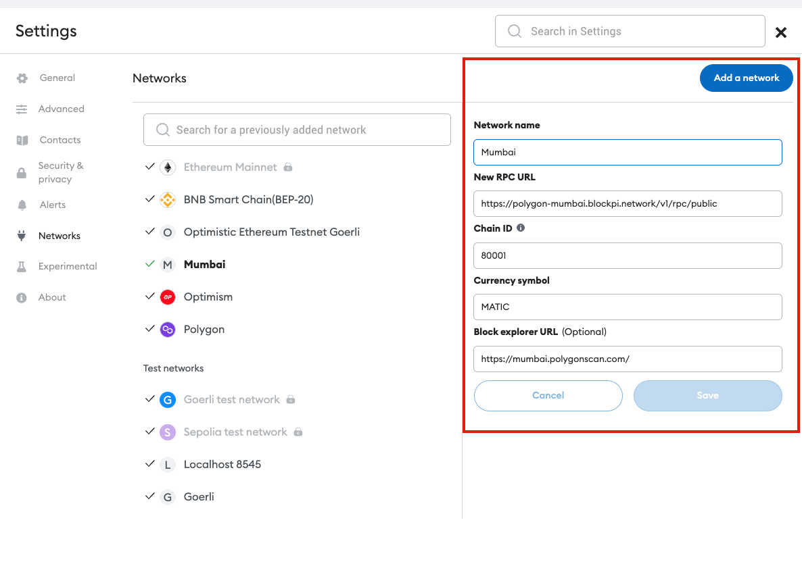<figcaption><p>Add network screen in MetaMask</p></figcaption></figure>

## **`changeMetamaskNetwork`**

Change network in MetaMask.

Predefined networks: `mainnet`, `goerli`, `sepolia` , `localhost`

If no network is provided, it will default to using the `NETWORK_NAME` environment variable. If not, it will default to `goerli` the network.

<pre class="language-typescript"><code class="lang-typescript"><strong>function changeMetamaskNetwork(networkName?: string): Chainable&#x3C;boolean>;
</strong></code></pre>

#### Example

```javascript
// Pass one of the predefined networks (mainnet, goerli, sepolia , localhost)
cy.changeMetamaskNetwork("mainnet");
// Pass the network name (from the Metamask networks dropdown menu)
cy.changeMetamaskNetwork("optimism network");
cy.changeMetamaskNetwork("sepolia");
```

#### Preview

<figure>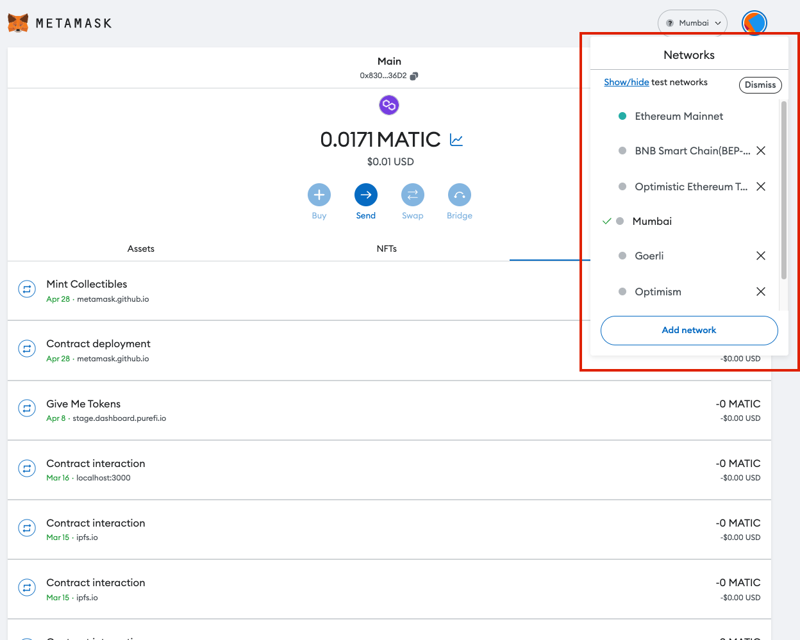<figcaption><p>Switch network from Metamask</p></figcaption></figure>

## **`importMetamaskAccount`**

Import a new account in Metamask using a private key.

```typescript
function importMetamaskAccount(pk: string): Chainable<boolean>;
```

#### Example

```javascript
cy.importMetamaskAccount(
  "0x2a871d0798f97d79848a013d4936a73bf4cc922c825d33c1cf7073dff6d409c6"
);
cy.importMetamaskAccount(Cypress.env("PRIVATE_KEY_WITH_FUNDS"));
```

#### Preview

<figure>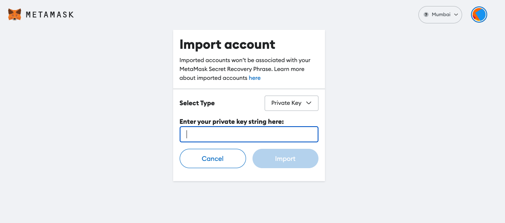<figcaption><p>Import account using private key in Metamask</p></figcaption></figure>

## **`createMetamaskAccount`**

```typescript
function createMetamaskAccount(accountName?: string): Chainable<boolean>;
```

#### Example

```typescript
// Create a new account with the default name
cy.createMetamaskAccount();
cy.createMetamaskAccount("custom-wallet");
```

#### Preview

<figure>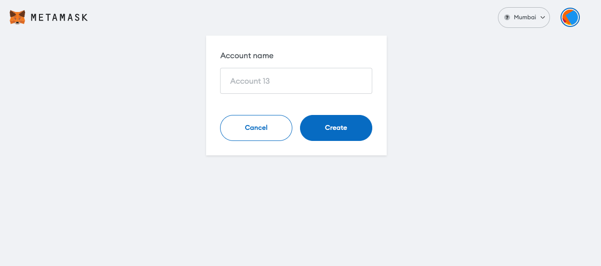<figcaption><p>Create new account in Metamask</p></figcaption></figure>

## **`switchMetamaskAccount`**

```typescript
function switchMetamaskAccount(
  accountNameOrAccountNumber: string | number
): Chainable<boolean>;
```

#### Example

```typescript
// Switch using the account number
cy.switchMetamaskAccount(2);
// Switch using the account name
cy.switchMetamaskAccount("account 1");
```

#### Preview

<figure>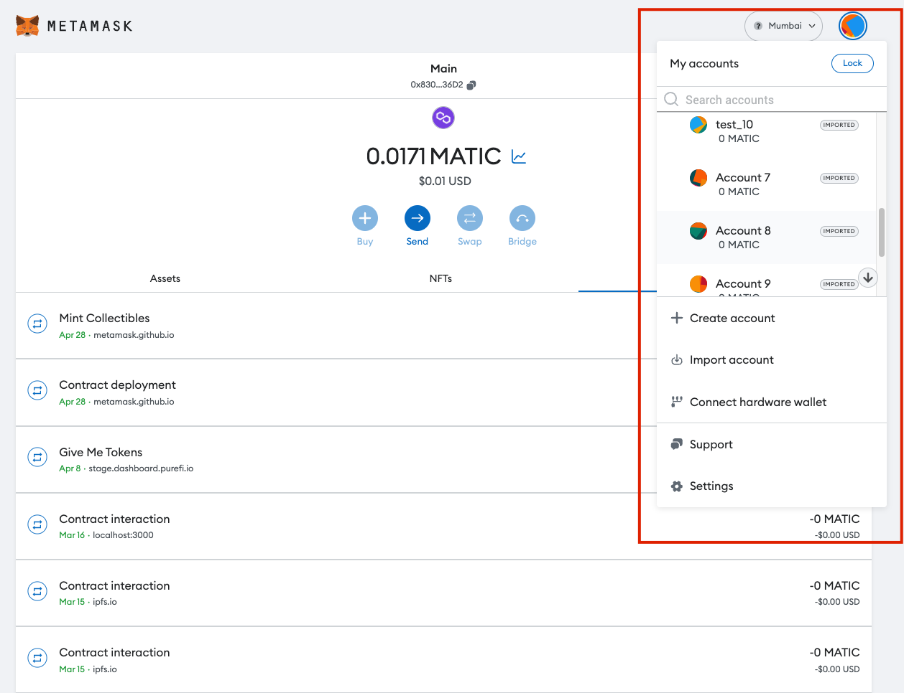<figcaption><p>Switch account from Metamask</p></figcaption></figure>

## **`getMetamaskWalletAddress`**

Get the current wallet address of Metamask wallet.

```typescript
function getMetamaskWalletAddress(): Chainable<string>;
```

#### Example

```typescript
cy.getMetamaskWalletAddress().then((address) => {
  expect(address).to.be.equal("0x70997970C51812dc3A010C7d01b50e0d17dc79C8");
});
```

## **`disconnectMetamaskWalletFromDapp`**

Disconnects Metamask wallet from last connected dApp.

```typescript
function disconnectMetamaskWalletFromDapp(): Chainable<boolean>;
```

#### Preview

<figure>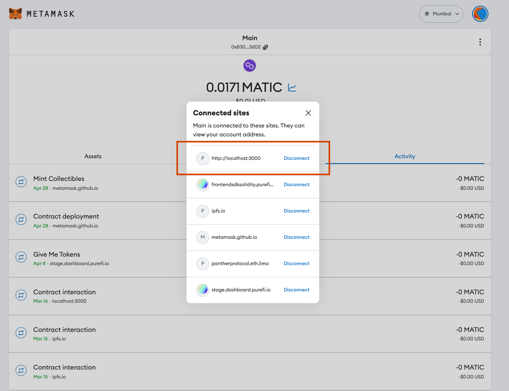<figcaption><p>Disconnect dApp from Metamask</p></figcaption></figure>

## **`disconnectMetamaskWalletFromAllDapps`**

Disconnects Metamask wallet from all connected dApps.

```typescript
function disconnectMetamaskWalletFromAllDapps(): Chainable<boolean>;
```

#### Preview

<figure>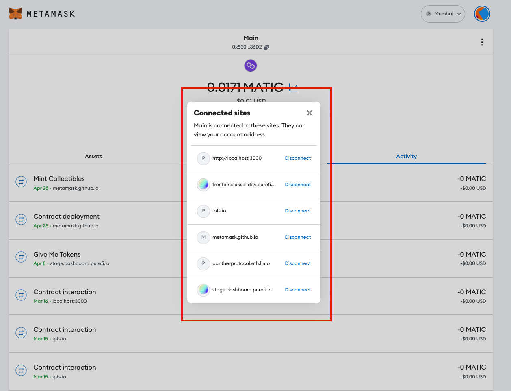<figcaption><p>Disconnect dApps from Metamask</p></figcaption></figure>

## **`confirmMetamaskSignatureRequest`**

Confirm Metamask's permission to sign a "regular" message.

```typescript
function confirmMetamaskSignatureRequest(): Chainable<boolean>;
```

#### Preview

<figure>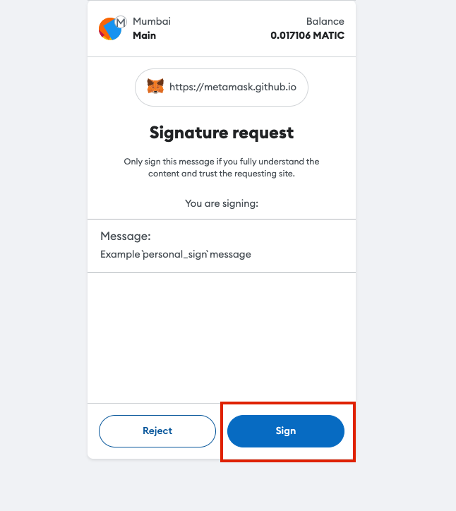<figcaption><p>Confirm signature request in Metamask</p></figcaption></figure>

## **`confirmMetamaskDataSignatureRequest`**

Confirm Metamask's permission to sign a Data "type 4" message.

```typescript
confirmMetamaskDataSignatureRequest(): Chainable<boolean>;
```

#### Preview

<figure>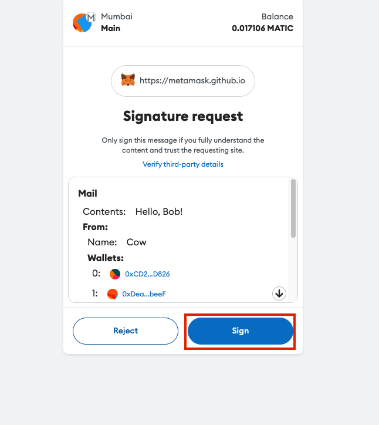<figcaption><p>Confirm data (type 4) signing request in Metamask</p></figcaption></figure>

## **`rejectMetamaskSignatureRequest`**

Reject Metamask permission to sign a "regular" message.

<pre class="language-typescript"><code class="lang-typescript"><strong>function rejectMetamaskSignatureRequest(): Chainable&#x3C;boolean>;
</strong></code></pre>

#### Preview

<figure>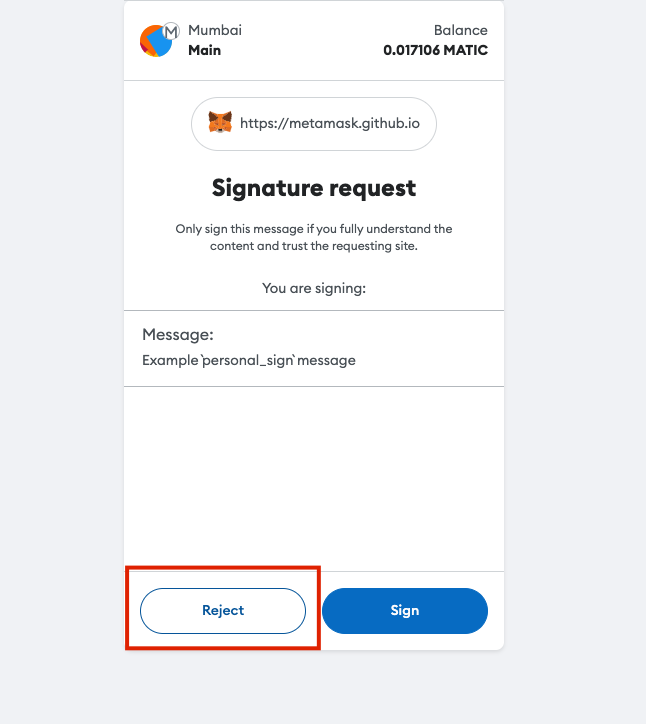<figcaption><p>Reject signature request from Metamask</p></figcaption></figure>

## **`rejectMetamaskDataSignatureRequest`**

Reject Metamask's permission to sign a Data "Type 4" message.

```typescript
function rejectMetamaskDataSignatureRequest(): Chainable<boolean>;
```

#### Preview

<figure>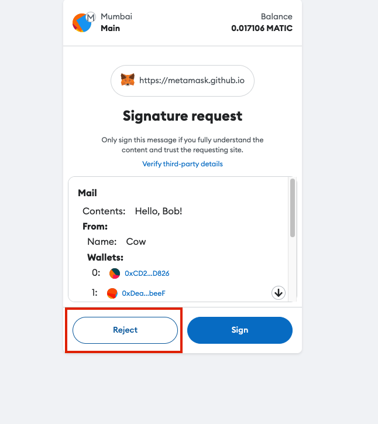<figcaption><p>Reject data (type 4) signing request in Metamask</p></figcaption></figure>

## **`confirmMetamaskEncryptionPublicKeyRequest`**

Confirm Metamask's request for the public encryption key.

```typescript
function confirmMetamaskEncryptionPublicKeyRequest(): Chainable<boolean>;
```

#### Preview

<figure><figcaption><p>Request encryption public key in Metamask</p></figcaption></figure>

## **`rejectMetamaskEncryptionPublicKeyRequest`**

Reject Metamask's request for the public encryption key.

```typescript
function rejectMetamaskEncryptionPublicKeyRequest(): Chainable<boolean>;
```

#### Preview

<figure><figcaption></figcaption></figure>

## **`confirmMetamaskDecryptionRequest`**

Confirm Metamask's request to decrypt a message with the private key.

```typescript
function confirmMetamaskDecryptionRequest(): Chainable<boolean>;
```

#### Preview

<figure><figcaption><p>Accept decryption request in Metamask</p></figcaption></figure>

## **`rejectMetamaskDecryptionRequest`**

Reject Metamask's request to decrypt the message with the private key.

```typescript
function rejectMetamaskDecryptionRequest(): Chainable<boolean>;
```

#### Preview

<figure>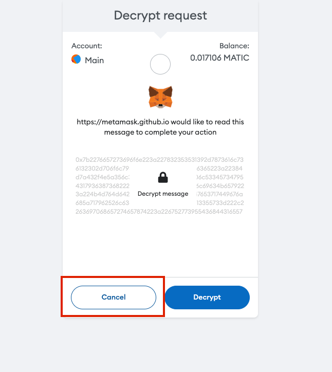<figcaption><p>Reject decryption request in Metamask</p></figcaption></figure>

## **`importMetamaskToken`**

Add custom token to Metamask.

```typescript
function importMetamaskToken(
  tokenConfig: { address: string; symbol: string } | string
): Chainable<{
  tokenContractAddress: string;
  tokensymbol: string;
  tokenDecimals: string;
  imported: boolean;
}>;
```

#### Example

```typescript
it(`importMetamaskToken should import token to metamask`, () => {
  const USDCContractAddressOnSepolia =
    "0xda9d4f9b69ac6C22e444eD9aF0CfC043b7a7f53f";
  cy.importMetamaskToken(USDCContractAddressOnSepolia).then((tokenData) => {
    expect(tokenData.tokenContractAddress).to.be.equal(
      USDCContractAddressOnSepolia
    );
    expect(tokenData.tokenSymbol).to.be.equal("USDC");
    expect(tokenData.tokenDecimals).to.be.equal("6");
    expect(tokenData.imported).to.be.true;
  });
});
```

#### **Preview**

<figure>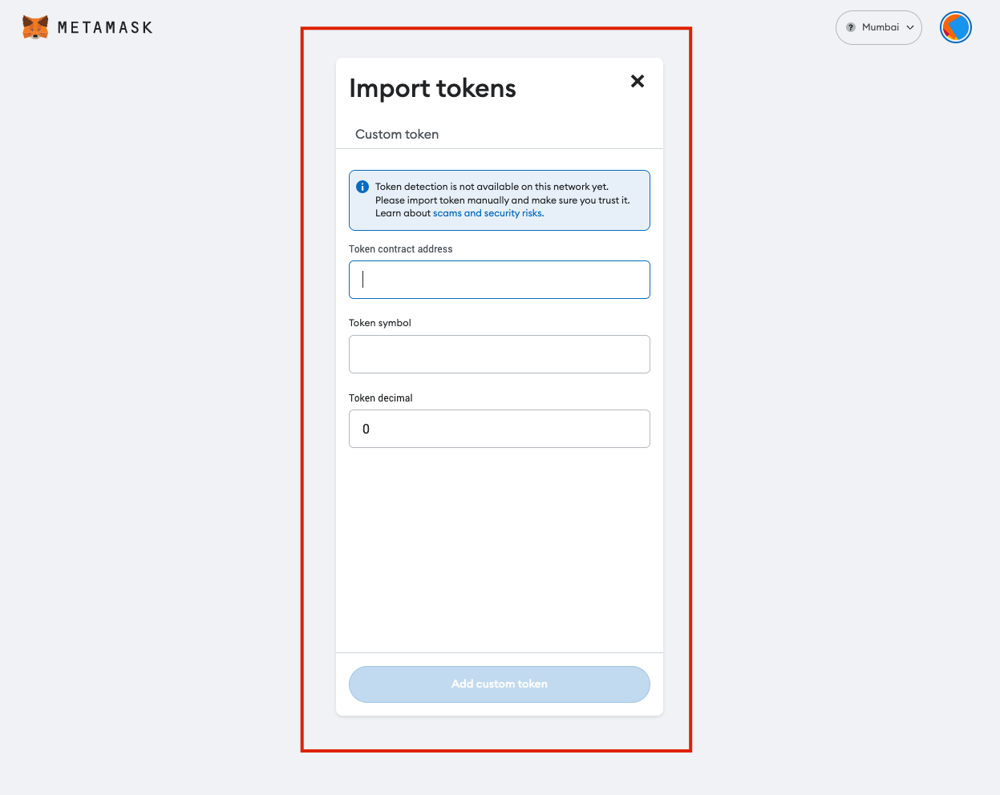<figcaption><p>Import token in Metamask</p></figcaption></figure>

## **`confirmMetamaskAddToken`**

Confirm Metamask's request to add a token.

```typescript
function confirmMetamaskAddToken(): Chainable<boolean>;
```

#### Preview

<figure>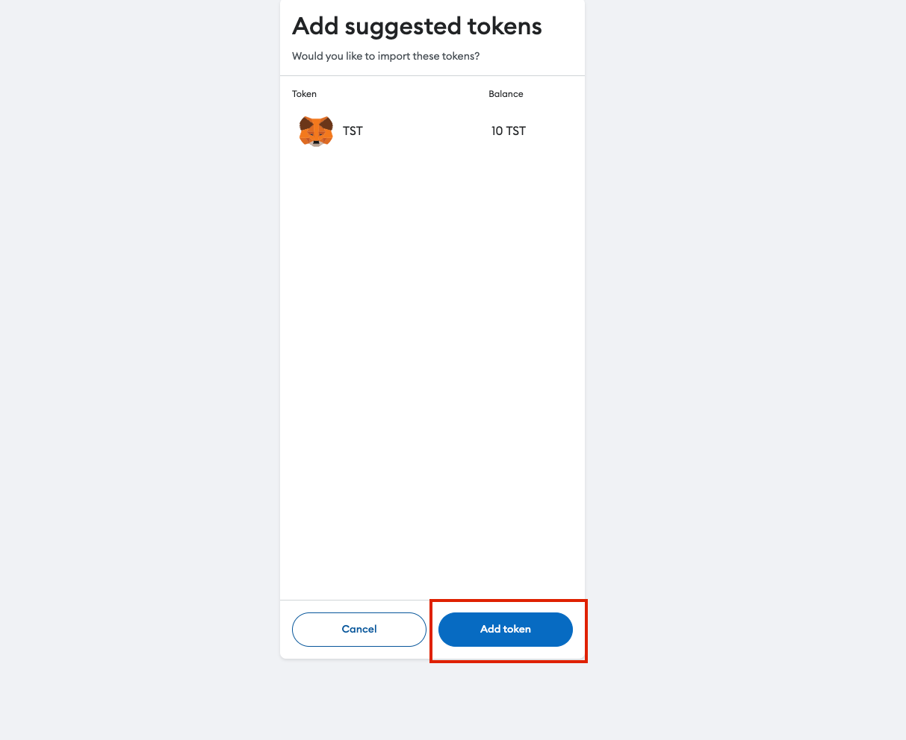<figcaption><p>Add tokens request to Metamask</p></figcaption></figure>

## **`rejectMetamaskAddToken`**

Reject Metamask's request to add a token.

```typescript
function rejectMetamaskAddToken(): Chainable<boolean>;
```

#### Preview

<figure>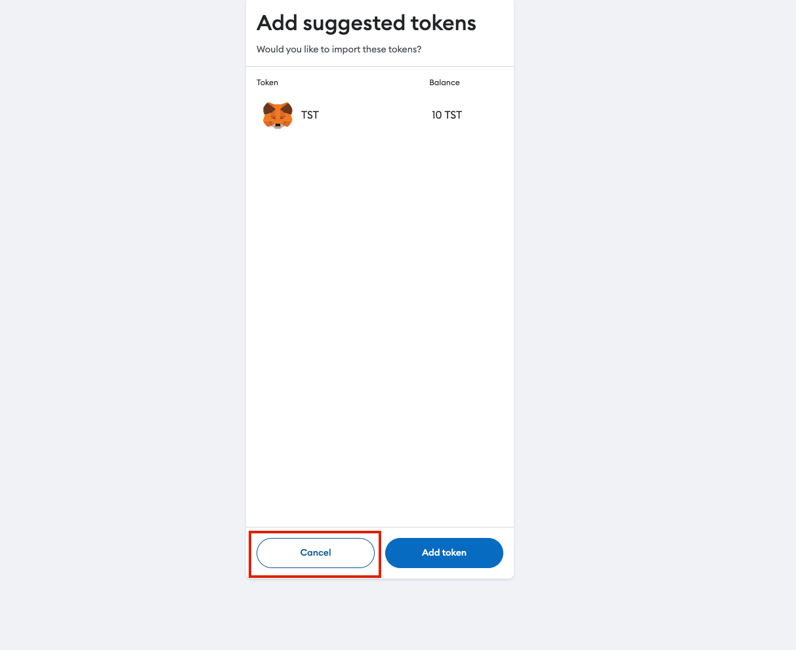<figcaption><p>Reject add token request in Metamask</p></figcaption></figure>

## **`confirmMetamaskPermissionToSpend`**

Confirm Metamask's permission to spend assets.

```typescript
function confirmMetamaskPermissionToSpend(
  spendLimit?: string
): Chainable<boolean>;
```

#### Preview

<figure>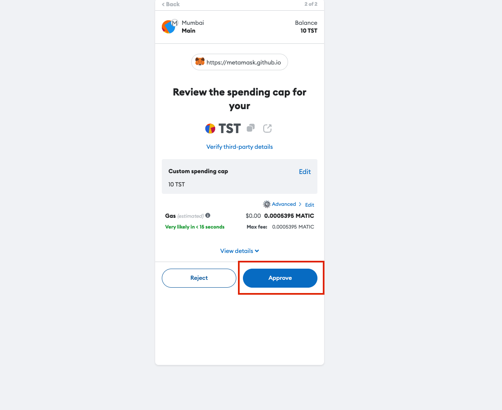<figcaption><p>Approve permission to spend tokens</p></figcaption></figure>

## **`rejectMetamaskPermissionToSpend`**

Reject Metamask's permission to spend assets.

```typescript
function rejectMetamaskPermissionToSpend(): Chainable<boolean>;
```

#### Preview

<figure>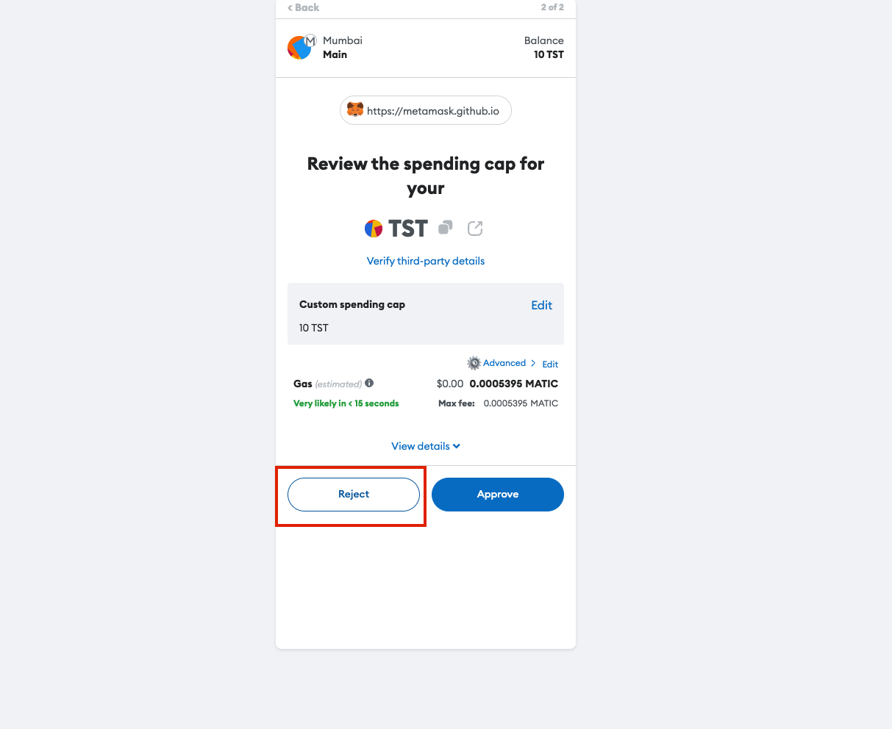<figcaption><p>Reject permission to spend tokens in MetaMask</p></figcaption></figure>

## **`acceptMetamaskAccess`**

Accept Metamask access request.

<pre class="language-typescript"><code class="lang-typescript"><strong>function acceptMetamaskAccess(options?: {
</strong>  allAccounts?: boolean; // Will select all the accounts.
  confirmSignatureRequest?: boolean; // Will accept "regular" signing request after connection. 
  confirmDataSignatureRequest?: boolean; // Will accept "data" signing request after connection. 
}): Chainable&#x3C;boolean>;
</code></pre>

#### Example

```typescript
// Use default Metamask options (will click next with the default selected account)
cy.acceptMetamaskAccess();
// Will accept "regular" signing requests after connection.
cy.acceptMetamaskAccess({ confirmSignatureRequest: true });
// Will accept "data" signing request after connection.
cy.acceptMetamaskAccess({ confirmDataSignatureRequest: true });
// Accept MetaMask connection to all accounts
cy.acceptMetamaskAccess({ allAccounts: true });
```

#### Preview

<figure><figcaption></figcaption></figure>

## **`confirmMetamaskTransaction`**

Confirm Metamask transaction (auto-detects `eip-1559` and legacy transactions).

```typescript
function confirmMetamaskTransaction(
  gasConfig?:
    | {
        gasLimit?: number;
        gasPrice?: number;
        baseFee?: number;
        priorityFee?: number;
      }
    | "low"
    | "market"
    | "aggressive"
    | "site"
): Chainable<{
  recipientPublicAddress: string;
  networkName: string;
  customNonce: string;
  confirmed: boolean;
}>;
```

#### Example

```typescript
it(`confirmMetamaskTransaction should confirm legacy transaction using default settings`, () => {
  cy.get("#sendButton").click();
  cy.confirmMetamaskTransaction().then((txData) => {
    expect(txData.recipientPublicAddress).to.be.not.empty;
    expect(txData.networkName).to.be.not.empty;
    expect(txData.customNonce).to.be.not.empty;
    expect(txData.confirmed).to.be.true;
  });
});
```

```typescript
cy.confirmMetamaskTransaction({
  gasLimit: 210000,
  gasPrice: 100,
}).then((txData) => {
  expect(txData.confirmed).to.be.true;
});
cy.confirmMetamaskTransaction("low");
cy.confirmMetamaskTransaction("market");
cy.confirmMetamaskTransaction("aggressive");
cy.confirmMetamaskTransaction("site");
```

#### Preview

<figure>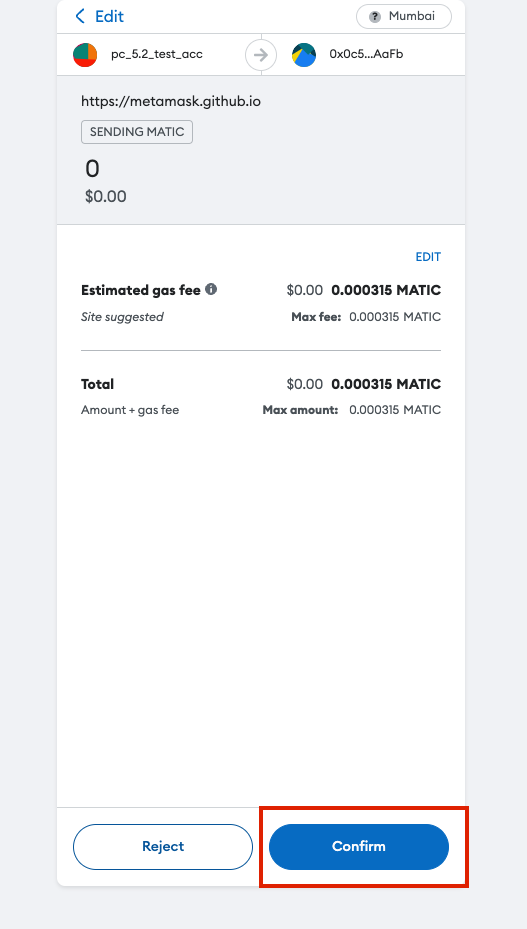<figcaption><p>Confirm Metamask transaction</p></figcaption></figure>

## **`rejectMetamaskTransaction`**

```typescript
function rejectMetamaskTransaction(): Chainable<boolean>;
```

#### Preview

<figure>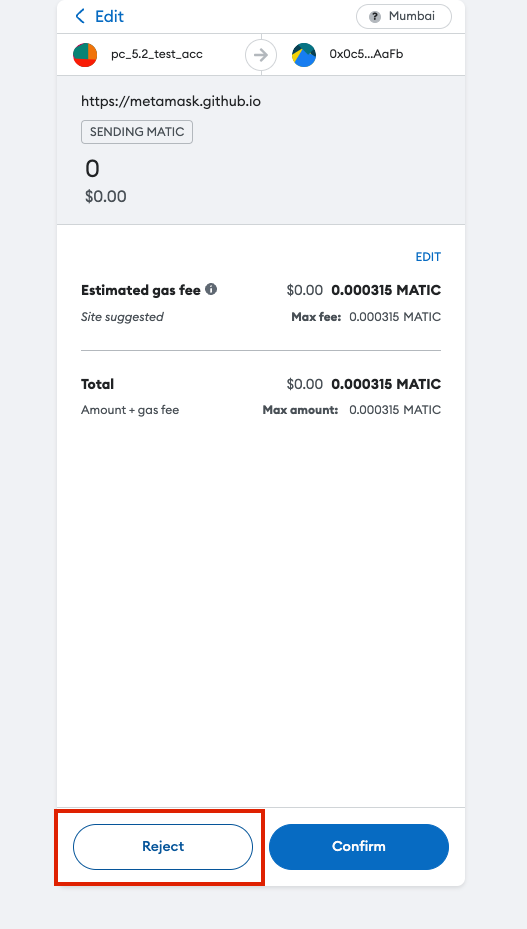<figcaption><p>Reject Metamask transaction</p></figcaption></figure>

## **`allowMetamaskToAddNetwork`**

Allow the dApp to add a new network in Metamask.

```typescript
function allowMetamaskToAddNetwork(waitForEvent?: string): Chainable<boolean>;
```

#### Example

```typescript
cy.allowMetamaskToAddNetwork("close");
```

#### Preview

<figure>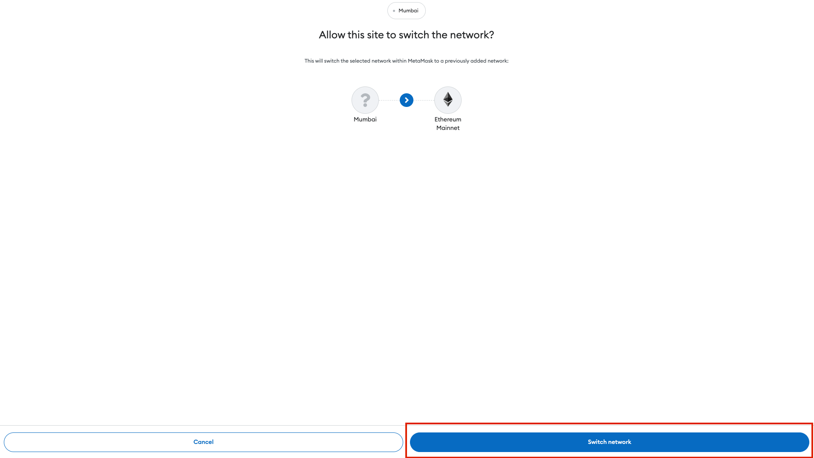<figcaption><p>Allow dApp to add a network in Metamask</p></figcaption></figure>

## **`rejectMetamaskToAddNetwork`**

Reject dApp to add a new network in Metamask.

```typescript
function rejectMetamaskToAddNetwork(): Chainable<boolean>;
```

#### Preview

<figure>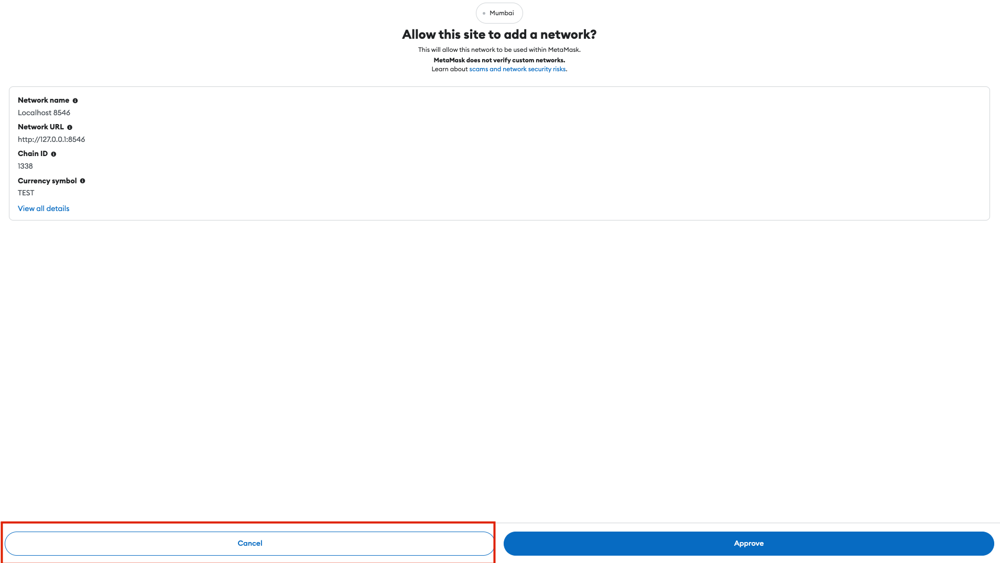<figcaption><p>Reject dApp to add a network in Metamask</p></figcaption></figure>

## **`allowMetamaskToSwitchNetwork`**

Allow the dApp to switch the network in Metamask.

```typescript
function allowMetamaskToSwitchNetwork(): Chainable<boolean>;
```

#### Preview

<figure><figcaption></figcaption></figure>

## **`rejectMetamaskToSwitchNetwork`**

Reject the dApp to switch the network in Metamask.

```typescript
function rejectMetamaskToSwitchNetwork(): Chainable<boolean>;
```

#### Preview

<figure>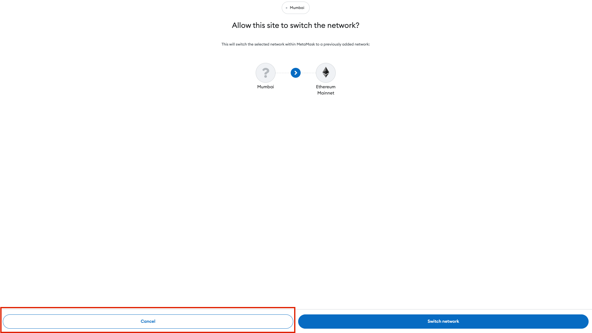<figcaption></figcaption></figure>

## **`allowMetamaskToAddAndSwitchNetwork`**

Allow the dApp to add a new network in Metamask and switch to it.

```typescript
function allowMetamaskToAddAndSwitchNetwork(): Chainable<boolean>;
```

## **`unlockMetamask`**

```typescript
function unlockMetamask(password: string): Chainable<boolean>;
```

#### Example

```typescript
cy.unlockMetamask("my_password");
```

#### Preview

<figure>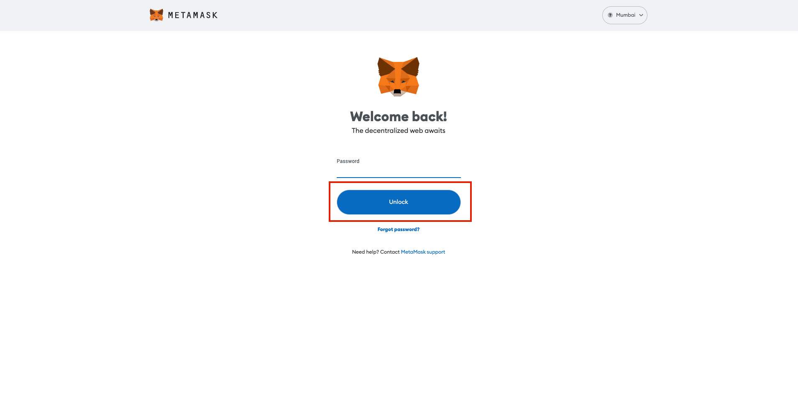<figcaption><p>Unlock Metamask</p></figcaption></figure>

## **`fetchMetamaskWalletAddress`**

Fetches previous Metamask wallet address.

```typescript
function fetchMetamaskWalletAddress(): Chainable<string>;
```

#### Example

```typescript
cy.fetchMetamaskWalletAddress().then((address) => cy.log(address));
```

## **`setupMetamask`**

Load the MetaMask extension and go through the setup process.

```typescript
setupMetamask(
  secretWordsOrPrivateKey?: string,
  network?: string | {
    networkName: string,
    rpcUrl: string,
    chainId: number,
    symbol?: string,
    blockExplorer?: string,
    isTestnet?: string,
  },
  password?: string,
  enableAdvancedSettings?: boolean,
  enableExperimentalSettings?: boolean,
): Chainable<boolean>;
```

#### Example

```typescript
cy.setupMetamask();
cy.setupMetamask("secret, words, ...", "goerli", "metamask_password");
cy.setupMetamask(
  "secret, words, ...",
  {
    networkName: "name",
    rpcUrl: "https://eth.llamarpc.com",
    chainId: 1,
    symbol: "ETH",
    blockExplorer: "https://etherscan.io/",
    isTestnet: true,
  },
  "metamask_password"
);
```

## **Etherscan API**

### **`etherscanGetTransactionStatus`**

Get transaction status from Etherscan API.

```typescript
type TxStatus = {
  status: string;
  message: string;
  result: {
    isError: string;
    errDescription: string;
  };
};

type TxReceipt = {
  blockHash: string;
  blockNumber: string;
  contractAddress: string | null;
  cumulativeGasUsed: string;
  effectiveGasPrice: string;
  from: string;
  to: string;
  gasUsed: string;
  logs: Array<any>;
  logsBloom: string;
  status: string;
  transactionHash: string;
  transactionIndex: string;
  type: string;
};

function etherscanGetTransactionStatus(txid: string): Chainable<{
  txStatus: TxStatus;
  txReceipt: TxReceipt;
}>;
```

#### Example

```typescript
cy.etherscanGetTransactionStatus(
  "0x3af85fa2369b75f327619f5968fd4cc08806ef9481d57ac32774beaf34641be9"
);
```

### **`etherscanWaitForTxSuccess`**

Wait until the transaction succeeds using Etherscan API.

```typescript
function etherscanWaitForTxSuccess(txid: string): Chainable<boolean>;
```

## MetaMask Settings

### **`activateAdvancedGasControlInMetamask`**

Activate the ability (in Metamask settings) to specify custom gas prices and limits while doing transactions in Metamask.

```typescript
function activateAdvancedGasControlInMetamask(
  skipSetup?: boolean
): Chainable<boolean>;
```

### **`activateShowHexDataInMetamask`**

Activate the ability (in Metamask settings) to show hex data while doing transactions in Metamask.

```typescript
function activateShowHexDataInMetamask(skipSetup?: boolean): Chainable<boolean>;
```

#### Preview

<figure><figcaption><p>Show hex data option in Metamask settings</p></figcaption></figure>

### **`activateTestnetConversionInMetamask`**

Activate the ability (in Metamask settings) to show fiat conversions on testnets in Metamask.

```typescript
function activateTestnetConversionInMetamask(
  skipSetup?: boolean
): Chainable<boolean>;
```

#### Preview

<figure>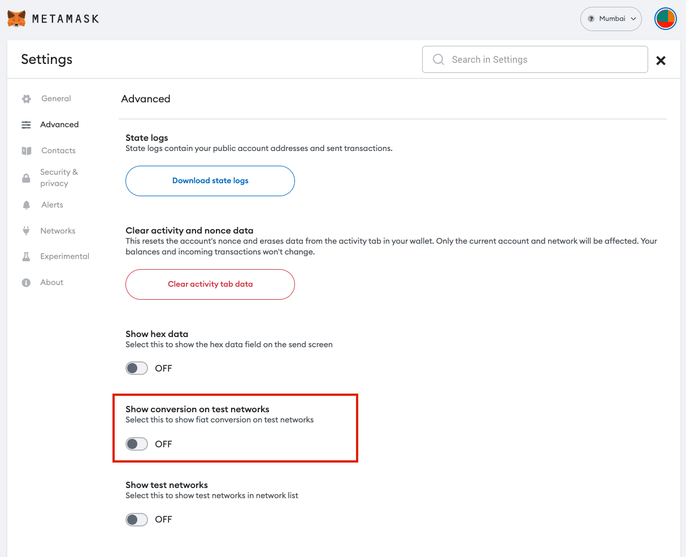<figcaption><p>Show conversion on test networks option in Metamask settings</p></figcaption></figure>

### **`activateShowTestnetNetworksInMetamask`**

Activate the ability (in Metamask settings) to show testnet networks in Metamask.

```typescript
function activateShowTestnetNetworksInMetamask(
  skipSetup?: boolean
): Chainable<boolean>;
```

#### Preview

<figure>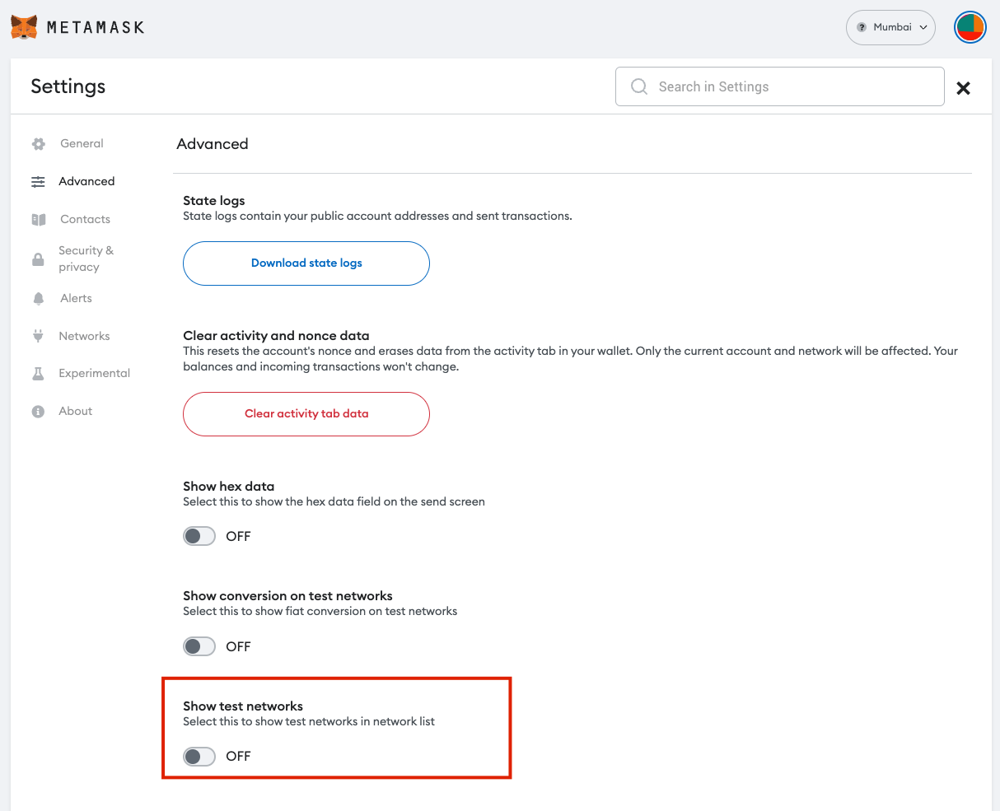<figcaption><p>Show test networks option in Metamask settings</p></figcaption></figure>

### **`activateCustomNonceInMetamask`**

Activate the ability (in Metamask settings) to specify custom nonce while doing transactions in Metamask.

```typescript
function activateCustomNonceInMetamask(skipSetup?: boolean): Chainable<boolean>;
```

#### Preview

<figure><figcaption><p>Customize transaction nonce option in Metamask settings</p></figcaption></figure>

### **`activateDismissBackupReminderInMetamask`**

Activate the ability (in Metamask settings) to dismiss secret recovery phrase reminders in Metamask.

```typescript
function activateDismissBackupReminderInMetamask(
  skipSetup?: boolean
): Chainable<boolean>;
```

#### Preview

<figure><figcaption><p>Dismiss secret recovery phrase backup reminder option in Metamask settings</p></figcaption></figure>

### **`activateEthSignRequestsInMetamask`**

Activate eth sign requests in Metamask settings.

<pre class="language-typescript"><code class="lang-typescript"><strong>function activateEthSignRequestsInMetamask(skipSetup?: boolean): Chainable&#x3C;boolean>;
</strong></code></pre>

#### Preview

<figure>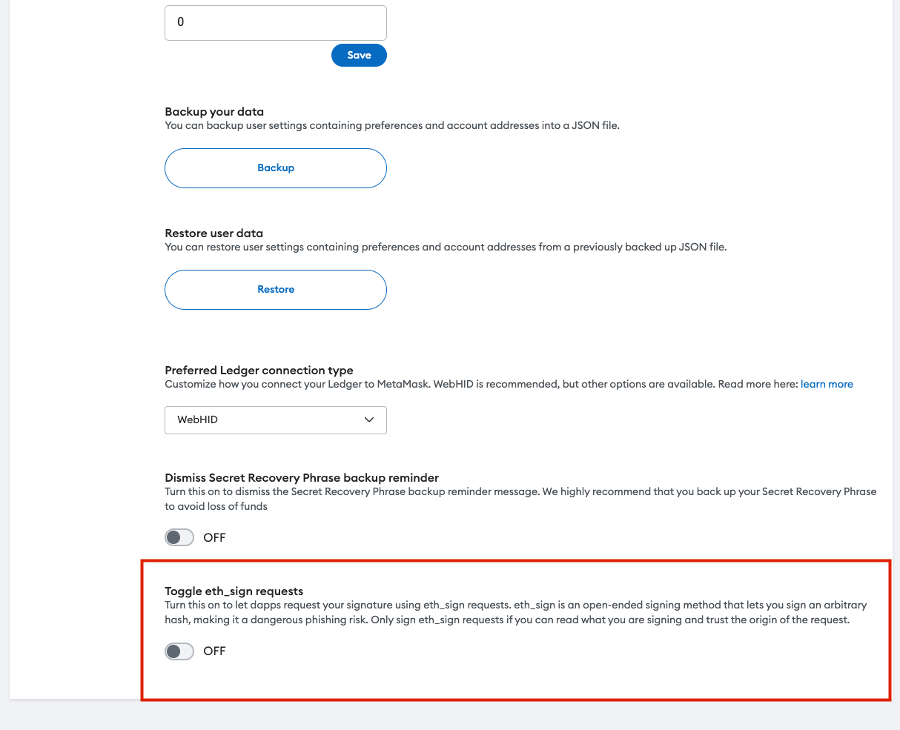<figcaption><p>Toggle eth_sign requests option in Metamask settings</p></figcaption></figure>

### **`activateImprovedTokenAllowanceInMetamask`**

Activate improved token allowance in Metamask settings (experimental).

```typescript
function activateImprovedTokenAllowanceInMetamask(
  skipSetup?: boolean
): Chainable<boolean>;
```

### **`resetMetamaskAccount`**

Reset the Metamask account state in settings.

```typescript
function resetMetamaskAccount(): Chainable<boolean>;
```

#### Preview

<figure>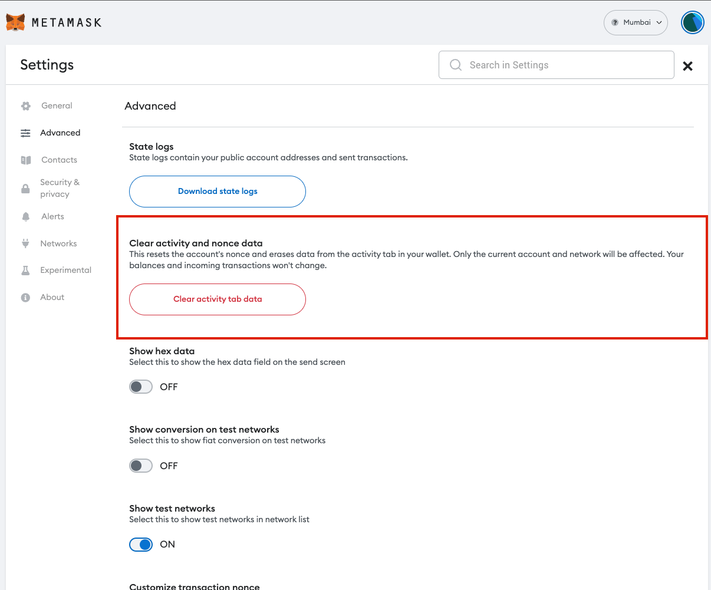<figcaption><p>Reset Metamask account</p></figcaption></figure>
